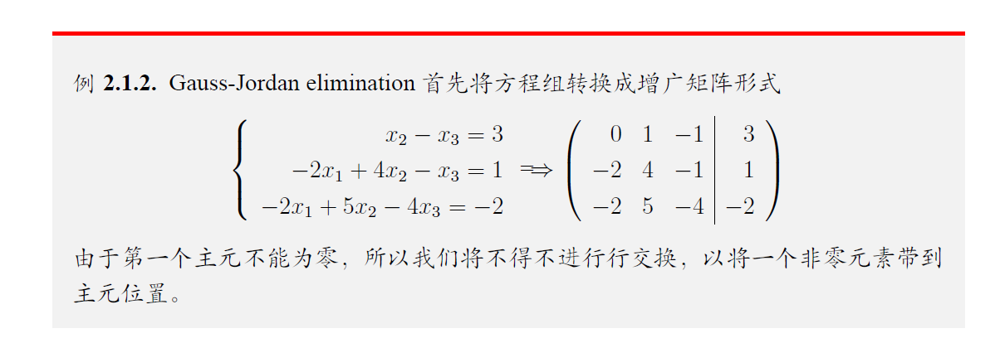
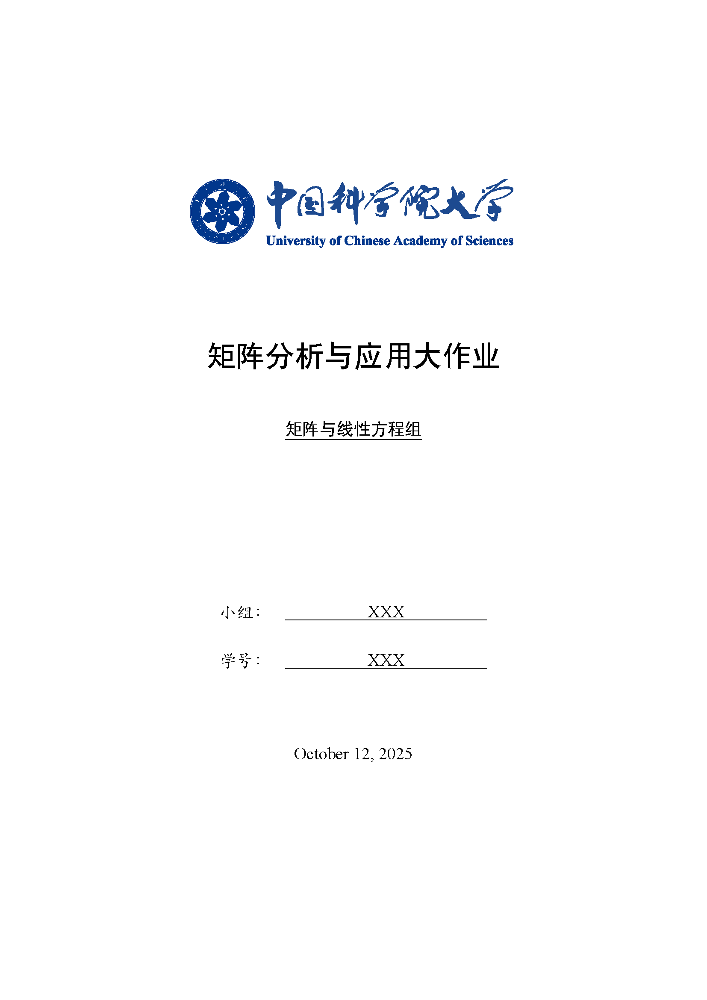
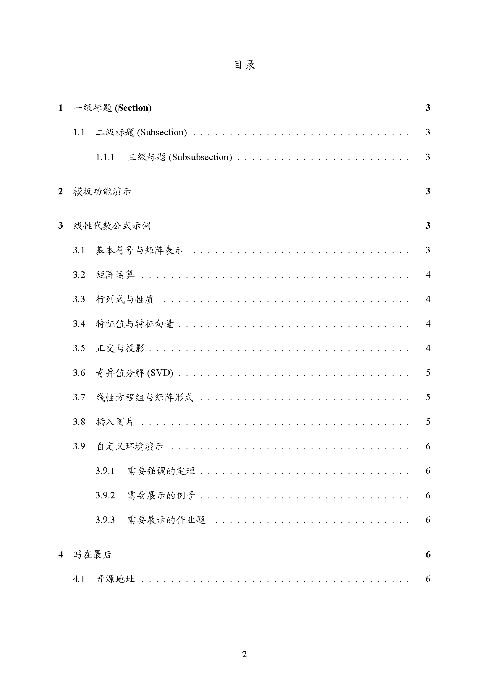

# UCAS-Matrix-Template
## 文档说明

* 国科大矩阵分析大作业模板，此文档或许还较为粗糙，仅供参考，欢迎提交pr来共同维护这个模板！
## 快速开始

* 页面右边点击：**Clone or download -> Download Zip**
* Overleaf模板也已经上传了，正在审核中，后续审核通过会及时更新

## 使用方法

这个模板由三个主文件构成

- `main.tex` 主文件,包含报告正文
- `ucas_matrix.sty` 文档格式控制，包括基础的设置
- `images` 放置图片的文件夹,包含院校LOGO和效果预览图

## 特殊的环境定义

为了更好的贴切书中以及老师所给示例中的pdf，做了如下两个特殊的环境，均已封装好

* 对于某些定理的说明，为了美观可以采用如下命令

```tex
\begin{bluebox}{解集合的三种可能性}
\begin{itemize}[leftmargin=*, labelsep=0.5em, itemsep=0.5em, topsep=0.5em]
  \item[■] \textbf{唯一解}：存在一组且仅有一组 $x_{i}$ 的值，同时满足所有方程
  \item[■] \textbf{无解}：不存在一组 $x_{i}$ 的值，同时满足所有方程—解集为空
  \item[■] \textbf{无限多解}：存在无穷多组不同的 $x_{i}$ 值，同时满足所有方程。很容易证明，如果一个系统有多个解，那么它就有无穷多个解。例如，一个系统不可能有确切的两个不同的解。
\end{itemize}
\end{bluebox}
```

* 效果：


* 对于示例和练习作业，我们可以采用封装好的example命令：

```tex
\begin{example}{Gauss-Jordan elimination}
首先将方程组转换成增广矩阵形式
$$
\left\{\begin{array}{r}
x_{2}-x_{3}=3 \\
-2 x_{1}+4 x_{2}-x_{3}=1 \\
-2 x_{1}+5 x_{2}-4 x_{3}=-2
\end{array} \Longrightarrow\left(\begin{array}{rrr|r}
0 & 1 & -1 & 3 \\
-2 & 4 & -1 & 1 \\
-2 & 5 & -4 & -2
\end{array}\right)\right.
$$
由于第一个主元不能为零，所以我们将不得不进行行交换，以将一个非零元素带到主元位置。
\end{example}
```

* 效果展示



## 效果概览

| [封面效果图](https://github.com/jweihe/UCAS_Latex_Template/blob/main/figures/ucas_report.png) | [目录效果图](https://github.com/jweihe/UCAS_Latex_Template/blob/main/figures/index.png) |
| :----------------------------------------------------------: | :----------------------------------------------------------: |
|                                 |                                 |

## 参考

+ https://github.com/jweihe/UCAS_Latex_Template
+ [国科大学位论文LaTeX模板](https://github.com/mohuangrui/ucasthesis)
+ [北京大学课程论文模板](https://www.overleaf.com/latex/templates/bei-jing-da-xue-ke-cheng-lun-wen-mo-ban/yntmqcktrzfh)

